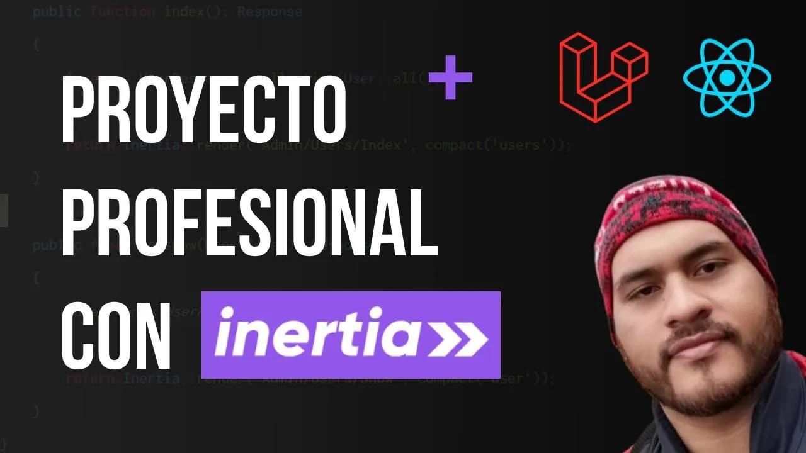

# Guía Completa para Aprender Inertia JS + Laravel 10 + React JS

Inertia.js es un framework JavaScript que ayuda a construir aplicaciones web interactivas sin la necesidad de recargar completamente la página. Se centra en la creación de experiencias de usuario fluidas y rápidas al aprovechar tecnologías como Vue.js o React, pero sin la complejidad de una arquitectura de aplicación de una sola página (SPA).

## Tabla de Contenido

1. [Creando Proyecto en Inertia JS + Laravel + React JS](https://youtu.be/mPflwQVvQtw?si=vpAmdGNMGVK5fdTs)
2. [Primeros Componentes Y Layouts en React JS](https://youtu.be/BVkBc6Bvph8?si=Q8481nsm2EZ4wqvU)
3. [Configuración de la Base de Datos + Seteando Datos de Prueba](https://youtu.be/29GiTkSFGcI?si=nByvR7HoDuOCeCB8)
4. [4 Formas de Envíar Respuesta desde el Servidor al Cliente Usando Inertia JS](https://youtu.be/i3t0--KiWw8?si=K9t0RFhU8qQ6TGSg)
5. [Agregando TailwindCSS a un Proyecto Laravel Existente](https://youtu.be/2y2du2Ngwlg?si=6AryhI-CgY4qNYjk)
6. [Viendo el Componente Link de Inertia JS](https://youtu.be/Z-ARZZnOmjU?si=x5XW1rDZ3QfE2IhA)
7. [Las Visitas Manuales de Inertia JS + Su Importancia](https://youtu.be/rNfmIjn9VXs?si=2sHtIV0tc8VwJBIf)
8. [Uso del Routing en Inertia JS](https://youtu.be/Z9t9t6CVqrs?si=cl1TxjutOLU1N_u5)
9. [Aplicando la Libreria Ziggy a Laravel](https://youtu.be/SswEl-9t1V0?si=YCAm1Xpa2oD5UWag)
10. [Primera Forma de Usar los Formularios en Inertia](https://youtu.be/hkbcva_5xuo?si=eBPXUDXbayr0N0sx)
11. [La Mejor Forma de Manejar Formularios en Inertia (Form Helpers)](https://youtu.be/-w_edoxxy_0?si=sX6dbQoSvpJAaUmd)
12. [Configuración para Subir una Imagen al Perfil del Usuario](https://youtu.be/aDKkk1ykuTY?si=rWvtScBhLSq7Kp77)
13. [Compartiendo Data de Manera Global en la Aplicación](https://youtu.be/hBFzBPLwOK0?si=pxiuamYK0vPbDaBB)
14. [Aplicando SEO en Nuestro Proyecto para Posicionarlo](https://youtu.be/6J8HV7gMrzA?si=EEqT594d7Ae39bgy)
15. [¿Cómo se Aplica Autenticación a un Proyecto Inertia JS?](https://youtu.be/uvGUfMw7o44?si=AzlLUKZ28xQP6G23)
16. [¿Cómo se Aplica Autorización a un Proyecto Inertia JS?](https://youtu.be/YjovF96gSmY?si=31uJTsJLZCHmuZtk)
17. [Mejorando la UX con una Carga de Pantalla](https://youtu.be/oJcyWPAa7VY?si=fBznefn7LVWdtSyT)
